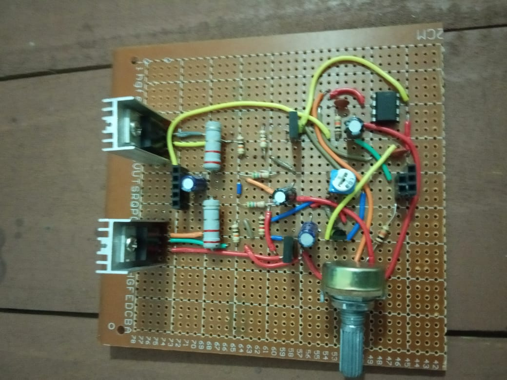

## The Analog-Piano

The electronic pianos available in the markets are using a pre-recorded audio of the sound to generate the tones. The task of this project is explore the possible analog designs to synthesize a tone. In this report, we have discussed our views and experiences on a stable design for synthesizing middle octave c-Note. An audio amplifier design that improvises the generated sound quality and capable of driving mid-power speakers is included in parallel at each stage.

## Block Diagram

## Circuit Diagram

### Amplifier

The complete report (downloadable) can be found [ here](https://github.com/sanjith1999/Analog-Piano/blob/master/Submission%20Files/Report/main.pdf)
 
 
### Breadboard Design

 
 
<h3>Prototype</h3>

